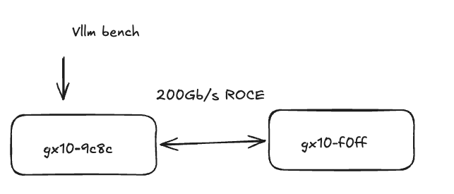
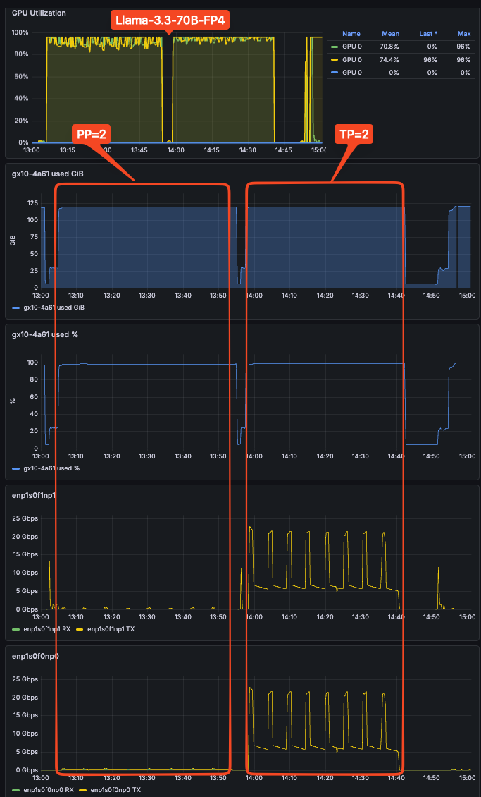
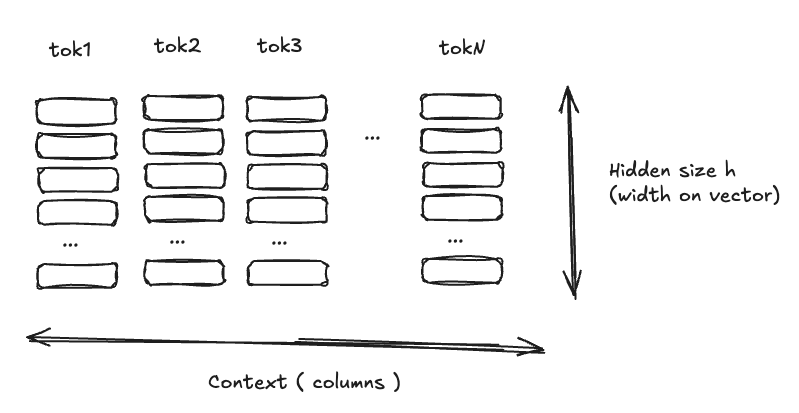
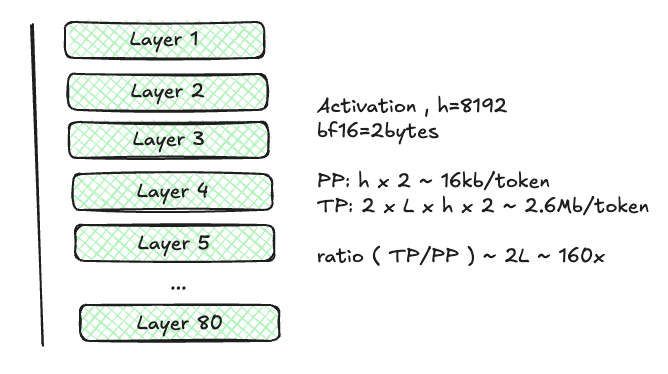

# TP vs PP on two DGX Sparks

Everyone benchmarks the speed. Almost nobody measures the network.

> **TL;DR** I split four LLMs across two DGX Sparks in two ways: tensor parallelism and pipeline parallelism. I measured both speed and network traffic. Tensor parallelism is about 14% to 37% faster, but it pushes about 100 to 290 times more data across the link between the boxes. On a fat interconnect, that is a good tradeoff. On a thin one, it is not. But who has a thin interconnect nowadays?

<video src="media/overview.mp4">Tensor (left) vs Pipeline (right): TP crosses the network at every layer, PP crosses once.</video>

> **Animation:** [Tensor vs Pipeline overview (local mp4)](media/overview.mp4) — or see the side-by-side GIF below: `media/Combined.gif`

For a while now I have been trying to make models serve faster on these boxes, and I wrote most of those experiments up on [my GitHub](https://github.com/myers-dev): [speculative decoding](https://github.com/myers-dev/spark-speculative-decoding), [running three models across two Sparks](https://github.com/myers-dev/testing-three-models-on-two-sparks), and [connecting two Sparks](https://github.com/myers-dev/connecting-two-sparks), plus the usual levers (quantization, bigger batches and higher concurrency, KV-cache tuning). Splitting one model across two machines is the next lever, and it comes in two flavors that behave very differently on the network. This post is about that difference.

I had two NVIDIA DGX Sparks (GB10) wired together through a 200 Gb/s RoCE switch, and a model that would not fit on one of them: Qwen3-235B-A22B. I ran the same comparison on three more models for breadth (Llama-3.3-70B-FP4, Qwen2.5-72B-AWQ, gpt-oss-120b). That leaves two ways to split it. I can give each box a contiguous block of layers and let the activation flow up the stack, crossing to the second box once. That is pipeline parallelism. Or I can split every layer across both boxes, so the two halves reconcile their partial results on every layer. That is tensor parallelism. Both free up the memory I need. What they do to the wire between the machines is very different, and that is the whole story. Everyone quotes the speed side of this. Almost nobody shows the network side, so I measured both.

Tensor parallelism is a cut straight down the middle of a fully connected network. Each layer's neurons live half on GPU 0 and half on GPU 1, so before the next layer can run, the two GPUs exchange and sum their partial outputs. That is an all-reduce, and it happens twice per transformer layer (once after attention, once after the MLP). The forward pass still climbs layer by layer, but that climb is local to each GPU. The network cost is the per-layer all-reduce.

<video src="media/TensorParallel.mp4">Tensor parallel: the cut is parallel to the dataflow, so every layer crosses the network.</video>

*(higher-quality mp4: [media/TensorParallel.mp4](media/TensorParallel.mp4))*

Pipeline parallelism cuts the other way, by depth. The activation runs through the first half of the layers on GPU 0, takes one trip across the link to GPU 1, and finishes there. One hidden-state transfer per token, and that is it.

<video src="media/PipelineParallel.mp4">Pipeline parallel: the cut is perpendicular to the dataflow, so it crosses the network once.</video>

*(higher-quality mp4: [media/PipelineParallel.mp4](media/PipelineParallel.mp4))*

Just from how the two splits work, I can already guess the network traffic: tensor parallel crosses the link on every layer, pipeline crosses once. What the diagram does not tell me is which one is faster. So I ran them.

**How I ran it.** I used the same backend for both modes so the comparison is fair: NVIDIA's vLLM container from NGC (`nvcr.io/nvidia/vllm:26.04-py3`, vLLM 0.19.0) with Ray on top for the multi-node part, both from NVIDIA's DGX Spark playbooks.

Every run uses `--enforce-eager`. The way I understand it: vLLM normally records the model's forward pass into a CUDA graph, which is a saved list of GPU operations it can replay in one shot instead of launching each one from the CPU every time (that launch overhead is what slows small-batch decode). On the GB10 that recording step did not work for me. Multi-node tensor parallel hangs while it captures the graph: it stops at `Capturing CUDA graph shapes`, GPU 0 sits at about 96% spinning on the all-reduce, GPU 1 sits idle, and the only fix is a reboot. I do not have physical access to the machines right now, so a reboot means waiting for someone to come and physically unplug my Spark. It hung the same way on the 8B and the 70B, so I gave up on graphs and ran everything in eager mode (capture turned off). I used eager for pipeline parallel too, so neither side has an unfair edge.

For the network settings I copied NVIDIA's playbook. In plain terms: `NCCL_IB_HCA` picks which RoCE cards to use, `NCCL_SOCKET_IFNAME=enP2p1s0f1np1` picks the network interface, `NCCL_IB_DISABLE=0` keeps RDMA on, `--device /dev/infiniband` exposes the NIC to the container, and `--ulimit memlock=-1` lets it pin memory for RDMA. If that last one is missing, it fails with `ibv_reg_mr ... Cannot allocate memory`.

For load I used `vllm bench serve` (random 1024-in / 1024-out, 1000 prompts, fixed seed). It has become my favorite benchmarking tool: one command and it runs against the live server.

**Which one is faster.** Tensor parallelism is the faster option in every run, on both throughput and per-token latency. That puzzled me at first, because both modes use the same two GPUs and the same total compute, so why would one be faster? The reason is *when* the work happens. Under tensor parallelism both GPUs work on the same layer at the same time (each does half of that layer's matrix multiplications), so the layer finishes sooner and the per-token latency drops. Under pipeline parallelism the two GPUs hold different layers, so GPU 1 cannot start until GPU 0 hands it the activation; for a single request the stages run one after another. Tensor parallel turns that serial wait into parallel compute. This is the split introduced in the [Megatron-LM paper (Shoeybi et al., 2019)](https://arxiv.org/abs/1909.08053); I am not completely clear on every detail, but that is the source. The numbers are in the table.

| Model | Mode | conc | Total tok/s | TTFT p50 | ITL p50 | **Avg inter-node Gb/s** |
|---|---|---|---|---|---|---|
| [Llama-3.3-70B-FP4](https://huggingface.co/nvidia/Llama-3.3-70B-Instruct-FP4) (dense) | Pipeline (PP=2) | 128 | 355 | **3.0 s** (win) | 306 ms | **0.19 Gb/s** |
| [Llama-3.3-70B-FP4](https://huggingface.co/nvidia/Llama-3.3-70B-Instruct-FP4) | Tensor (TP=2) | 128 | **404** (win) | 3.1 s | **257 ms** (win) | **37.6 Gb/s** |
| [Qwen3-235B-A22B](https://huggingface.co/Qwen/Qwen3-235B-A22B) (MoE) | Pipeline (PP=2) | 128 | 224 | **2.4 s** (win) | 534 ms | **0.060 Gb/s** |
| [Qwen3-235B-A22B](https://huggingface.co/Qwen/Qwen3-235B-A22B) | Tensor (TP=2) | 128 | **307** (win) | 2.5 s | **371 ms** (win) | **17.4 Gb/s** |
| [Qwen2.5-72B-AWQ](https://huggingface.co/Qwen/Qwen2.5-72B-Instruct-AWQ) (dense) | Pipeline (PP=2) | 128 | 181 | 12.2 s | 510 ms | **0.098 Gb/s** |
| [Qwen2.5-72B-AWQ](https://huggingface.co/Qwen/Qwen2.5-72B-Instruct-AWQ) | Tensor (TP=2) | 48 | **364** (win) | **6.5 s** (win) | **187 ms** (win) | **17.1 Gb/s** |
| [gpt-oss-120b](https://huggingface.co/openai/gpt-oss-120b) (MoE) | Pipeline (PP=2) | 128 | 222 | 0.6 s | 184 ms | **0.205 Gb/s** |
| [gpt-oss-120b](https://huggingface.co/openai/gpt-oss-120b) | Tensor (TP=2) | 48 | **2641** (win) | **0.3 s** (win) | **86 ms** (win) | **22.6 Gb/s** |

Pipeline parallelism barely uses the network, tenths of a Gb/s. Tensor parallelism runs at tens of Gb/s: 37.6 against 0.19 on Llama-70B (about 198 times), and about 290 times on Qwen3-235B.

**Predicting the traffic.** It would be interesting to predict that traffic up front, and based on my understanding it falls straight out of the model's shape. Three things matter.

First, the hidden size `h`, the width of the activation vector that represents one token between layers. For Llama-70B, `h = 8192`. This is not the context window. The context window is how many tokens you can attend over; the hidden size is how wide each token's vector is. They are independent: a longer context gives you more vectors, not wider ones, and the thing that crosses the network is one width-`h` vector per token per layer, whatever your prompt length. The hidden size is also what sizes the KV cache (each token stores a key and a value vector of width `h` per layer), but the KV cache stays on its own GPU; it is not what crosses the link. See the diagram below.

Second, the layer count `L`. Llama-70B has 80, Qwen2.5-72B also has 80, Qwen3-235B-A22B has 94, and gpt-oss-120b has 36. All four numbers come from `num_hidden_layers` in each model's `config.json` on its Hugging Face model card.

Third, the bytes per number, which depends on the dtype, the data type that sets how many bits each value in a tensor uses: fp32 is 4 bytes, fp16 and bf16 are 2 bytes, fp8 is 1 byte. AFAIK most of open models run their activations in bf16 (Llama, Qwen, gpt-oss), so 2 bytes is the common case. Even when the weights are quantized smaller (AWQ int4, NVFP4, fp8), the activations that travel between GPUs are still bf16. AWQ, for example, is weight-only quantization by design; the activations stay fp16/bf16 ([Lin et al., 2023](https://arxiv.org/abs/2306.00978)).

Then the collective. Why all-reduce, and not all-gather or broadcast? In tensor parallelism each GPU computes a partial sum of the layer's output, so you have to add those partials together and give the result back to both GPUs. Add-and-share-to-everyone is exactly an all-reduce. With those, the per-token traffic is:

| Quantity | Llama-70B |
|---|---|
| hidden size `h` | 8192 |
| layers `L` | 80 |
| bytes per number (bf16) | 2 |
| Pipeline, per token = `h × bytes` | 16 KB (one transfer) |
| Tensor, per token = `2 × L × h × bytes` | 2.6 MB (two all-reduces, every layer) |
| predicted ratio = `2L` | 160x (2.6 MB / 16 KB = 160) |

I expected this to be a rough guess. It came out close enough: 160x predicted, 198x measured on Llama-70B. The takeaway holds either way: tensor-parallel traffic scales with depth, pipeline does not.

**Result 1: the mixture-of-experts model behaves like a dense one.** Dense means every weight in a layer works on every token; a mixture-of-experts model instead keeps many parallel expert sub-layers and routes each token through only a few of them. Qwen3-235B does not add extra all-to-all expert traffic under tensor parallelism; its experts are split across the GPUs like any other layer weights, so it follows the same `2L` rule. Its 290x ratio is high only because its pipeline traffic is unusually small (few active parameters per token).

**Result 2: quantization does not change the network.** AWQ int4 (Qwen2.5-72B) and NVFP4 (Llama-70B) move the same bytes, because the activations stay bf16 regardless of how the weights are compressed. Quantization saves memory and compute, not network.

**Which I would pick.** Tensor parallelism, and not just for this cluster: I see no reason to run pipeline parallelism going forward. The network is the component that is supposed to be sized for the job. The ConnectX-7 NIC gives 200 Gb/s of RoCE, and even the heaviest all-reduce I measured, 37.6 Gb/s, fits inside that with room to spare, so the lower latency and higher throughput cost nothing. And the gap is not small. On gpt-oss-120b, tensor parallel delivered 2641 tok/s against 222 for pipeline and cut inter-token latency from 184 ms to 86 ms; a 500-token answer streams in about 43 seconds instead of 92. Who is running a 10 or 25 GbE backend for GPU-to-GPU traffic anyway? Those speeds live on management ports, older campus gear, and homelab switches; a backend fabric for accelerators starts at 100 Gb/s today and is commonly 200 or 400. If your inter-node link really is 10/25 GbE, pipeline parallelism remains the safe fallback, because the all-reduce saturates the link before compute does, but at that point the thing to fix is the link, not the parallelism.

